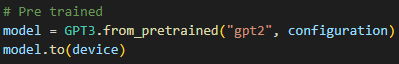
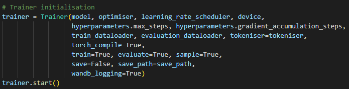
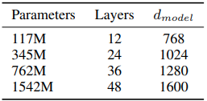
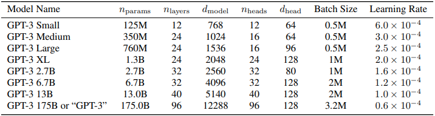
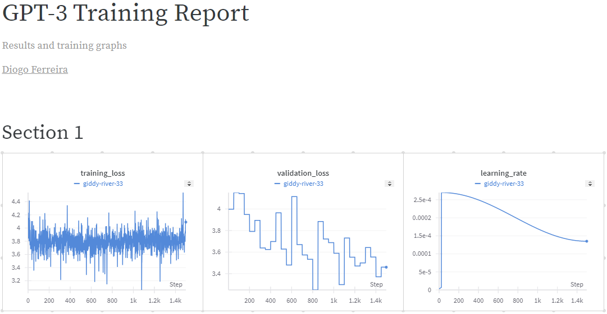

# LLM Journey

This project follows the principle of iteratively implementing small building blocks each coming closer to the original GPT3 (124M) implementation. My goal was to create an initially clear and simple implementation that could be used for pedagogical purposed. Hence to provide breadth and depth for people of varying skill sets several components ranging from optimisation and logging to tokenisation and dataloading were heavily used and heavily commented to the best of my understading.

The repository should allow easy tokeniser and GPT model training and can be easily modified to fit any new needs. 

#### The finalised components implemented in this project have been separated: 
- main.py - script with tunable hyper parameter configurations
- gpt.py - transformer implementation
- tokeniser.py - BPE tokeniser, (r50k_base equivalent)
- trainer.py - training class with weights and biases logging
- dataloader.py - huggingface LLM dataset streaming dataloader

Skip [here](#results) to see the of my GPT 3 Large (0.76B param) model

## How to

### Loading the pretrained model weights

Loading and sampling from a pretrained GPT-2 model is easy, select the following model in the main.py script.

You can then customise what you wish to do with this pretrained model, you can evaluate it on the validation dataset (the default will be the FineWebEdu dataset), sample or even train it further.

### Training your own model

To train your own model I would recommend using Kaggle or Google Colab, Kaggle provides 30h of compute per week, resetting every Saturday.

Simply choose your own GPT and Trainer configurations and run the script.

If you wish to create one of the GPT-2, GPT-3 paper models here are the following configurations.

Tips:
- You will most likely have to tune your configuration to match the compute that you have been provided with. For example if you are using Kaggle your GPU will be limited to 16GB of VRAM so training models larger than GPT-3 Large is not recommended as you will get "RuntimeError: CUDA error: out of memory"
- Check that the GPU that you are using is torch.compile compatible otherwise set it to False within the Trainer
- Same applies with autocast

### Datasets

Here is an [awesome repository (LLMDataHub)](https://github.com/Zjh-819/LLMDataHub?tab=readme-ov-file) you can use if you want to train your own model on a different dataset - make sure you choose Pre Training datasets for this model (PT) 

The dataset I used is the [FineWeb Edu dataset](https://huggingface.co/spaces/HuggingFaceFW/blogpost-fineweb-v1) - specifically the 10B sample. You can change this sample to be any you wish, or any other dataset in the huggingface library that uses the same format, simply change the Dataloader link.

### Understanding the tokeniser

This [tokenisation website](https://tiktokenizer.vercel.app), examples of how the tokeniser works

## Papers

The following papers were read and used to match the GPT3 implementation to its true origin, understand the separate components and optimise the model

- [Attention is all you need](https://arxiv.org/pdf/1706.03762)

- [Flash attention](https://arxiv.org/pdf/2205.14135)

- [Flash attention 2](https://arxiv.org/pdf/2307.08691)

- [Language models are unsupersived multitask learners](https://d4mucfpksywv.cloudfront.net/better-language-models/language_models_are_unsupervised_multitask_learners.pdf)

- [Language models are few-shot learners](https://arxiv.org/pdf/2005.14165)

- [GPT-4 technical report](https://arxiv.org/pdf/2303.08774)

## Changes & Optimisations

A lot of the following optimisations took advantage of kernel fusion, I found [this to be an interesting read](https://stackoverflow.com/questions/53305830/cuda-how-does-kernel-fusion-improve-performance-on-memory-bound-applications-on) and an easy way to understand it

This PyTorch [article explaining the optimisations behind fastGPT](https://pytorch.org/blog/accelerating-generative-ai-2/) is also a great read

**Changes**
- Using own implementation of tokeniser
- Using FineWeb-Edu / SlimPajama for training https://huggingface.co/spaces/HuggingFaceFW/blogpost-fineweb-v1 sample-10BT / sample-100BT, this data is streamed to prevent downloading
- Data randomly sampled without replacement to reduce overfitting during training
- Created model saving using torch state dictionaries, these can be used for checkpointing and continuous training
- Weights and Biases logging for model training implemented into the Trainer

**Optimisations**
- AdamW fused kernel - combining sequential steps into a singular kernel to optimise the memory access patterns
- Following the weight sharing scheme mentioned and preventing the double initialisation of the wte and ln tensors
- Using powers of 2 for most parameters
- Autocast (Automatic mixed precision) is a context manager / decorator that allows regions of the script to run in mixed precision - making sure to use bfloat16 instead of the reduced precision float16
- Preventing reinitialisation of wte and lm_head as they share the same tensor
- torch.compile
- Using FlashAttention which torch.compile
- Training can tolerate significantly lower precisions, we can go from 19.5 TFLOPS to 312 TFLOPS using an A100 by switching from FP32 TO FP16 and TF32 - TensorFloat-32 provides an 8x faster approximation - as long as you don't mind the loss in precision

## Future ideas & Improvements

1. Potential improvements includes:
[DDP (Distributed Data Parallel)](https://pytorch.org/tutorials/intermediate/ddp_tutorial.html#:~:text=DistributedDataParallel%20(DDP)%20implements%20data%20parallelism,collective%20communications%20in%20the%20torch.).

Considerations for this improvement:
- Ensure that our gradient accumulation batch sizes are divisible by the ddp_world_size (the number of GPUs we have)
- Update our dataloader as we don't want any processes to get the same chunks of data, an easy way being we take in the rank of each process, the new positon would have to now be mini_batch_size * number_of_gpus so that they are strided out.
- Loss and gradients would have to be averaged across all processes, we can make our master / main process do the printing and logging information. 
- Logging would also have to take into account the number of GPUs processing especially in the tokens/second calculation.

2. Once pre trained it would be quite interesting to further take the model through fine-tuning stages that would allow it to interact in a conversational manner and being able to use RLHF. [OpenAI guidance is here](https://platform.openai.com/docs/guides/fine-tuning)

3. Consider using batch size scheduling like as used by the paper, potentially done by reinitialising the dataloader

4. Try implementing KV-Caching for better model inference

## Results

### My Model

Training images from weights and biases logging

### Comparison of model outputs

#### Randomly initialised weights

- I am a doctor, let me teach you aboutVIS speaksposition Fund Pulitzer Recently astronautsumbnails tutorialFloat loneliness shift358 Woods calibr Doyleiven sedanzengroups licking Auschwitz mindful Tripoli 125

- I am a doctor, let me teach you about facilit debunk stating951 customizationLet indicatorlifting Jenn052 BAD ashamed antitTra scripting funny nihil Houth Marc Maiden vegetarian 33 Punjab manslaughter shipping

#### Pretrained GPT2 (HuggingFace) (127M parameters)

- I am a doctor, let me teach you about the importance of mental health and family care," said the speech. "When you are an older man with mental illness, the

- I am a doctor, let me teach you about medicine. So, where do I live? I live here in the same building that you're in, and then I send

#### My GPT3 Large (0.76B parameters)

- I am a doctor, let me teach you about the risks from overdose-bearing diseases like hepatitis B, B and E. I want to say to everyone before giving them some blood.

- I am a doctor, let me teach you about the disease and medical issues. I should address any side effects associated with flu vaccines to help.

## Common Problems & Fixes

Making sure cuda is installed, you can use torch.cuda.is_available(). If false is returned the following resources were quite useful for me in diagnosing those errors.
- [Comprehensive StackOverflow Guide](https://stackoverflow.com/questions/60987997/why-torch-cuda-is-available-returns-false-even-after-installing-pytorch-with)
- [Nvidia Cuda ToolKit Download](https://developer.nvidia.com/cuda-downloads)

If you are using using Pytorch 3.12 does not currently support torch.compile and you may get this error - "RuntimeError: Dynamo is not supported on Python 3.12+".
- To solve this either set torch_compile = False in the Trainer() or install a supported Python version

## Credits

These resources were of great help in understanding the inner workings behind transformers and the GPT papers.

3Blue1Brown - [Mathematics behind transformers - Chapter 5/6](https://youtube.com/playlist?list=PLZHQObOWTQDNU6R1_67000Dx_ZCJB-3pi&si=7kUJ3D5-B24sOq7j)

OpenAI - [GPT-2 Tensorflow Implementation](https://github.com/openai/gpt-2/blob/master/src/model.py)

Hugging Face Tranformers - [GPT-2 PyTorch Implementation](https://github.com/huggingface/transformers/blob/main/src/transformers/models/gpt2/modeling_gpt2.py)

PyTorch - [Fast GPT Implementation and Article](https://github.com/pytorch-labs/gpt-fast)

Andrej Karpathy - [Zero to Hero: NN Course](https://youtube.com/playlist?list=PLAqhIrjkxbuWI23v9cThsA9GvCAUhRvKZ&si=xMIrxu1JbABFPRej)

